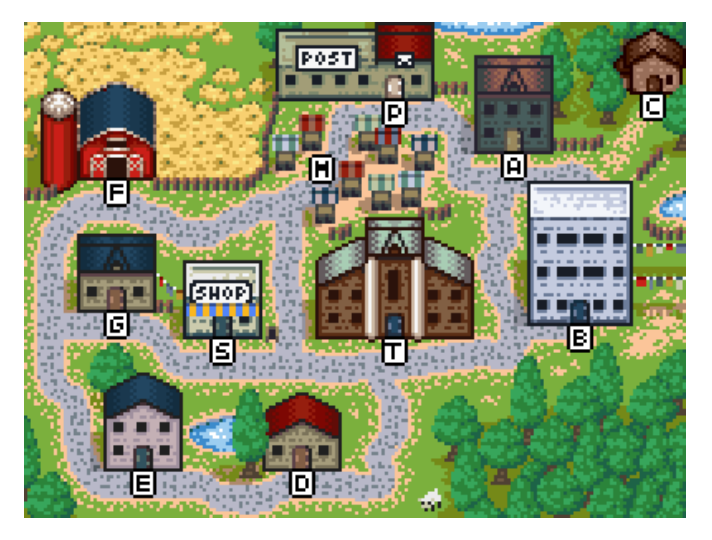
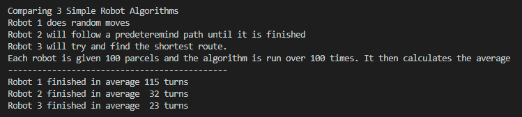

# Exercises / Projects

## Exercises Source: https://eloquentjavascript.net/
* min.js
* reverse.js
* sum.js
* vec.js

# Projects
Source https://eloquentjavascript.net/
* robot.js
* graph.js

## RobotJS simulates mail delivery in a fictional town with 11 places that have 14 interconnected roads.

First, I create a data structure that represents the town with a graph. Next, there is a single class for the village state
with a prototype method for moving. There is a function for setting the number of parcels needing delivery by randomly selecting destination. 

Next, following along I developed three different robot algorithms. The first picks a random destination. The second goes on a predeteremined route. The third is goal oriented and will try to pick the shortest route. The book ends the example here and has the user create a compare function. 

I developed a function that would compare two robots and simply display the results.

Finally, putting everything I learned. I created a function to compare the three algorithms. It displays a message to the user about what the program is doing, then it gives each algorithm 100 parcels to delivery. These parcels are ran >100 times then averaged to get an average turn around rate. It then displays the results to the user.

Things I learned:

How to fix decimal precision. I initial used toFixed(2) to round the average to two decimal places to make it look cleaner. Then I realized that a decimal amount of turns didn't make sense. Instead of using parseInt to convert the float to int, I used toFixed(0) to round the float to the nearest whole number since I already had the code.

Exporting in CommonJS format. I had to use the module.exports syntax to export the function. vs export ES6 syntax when breaking up the code.

Things I knew Before:

Next Steps:

